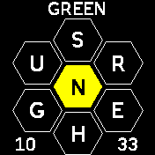

# Spelling bee game

Word finding game inspired by the NYT spelling bee. Find as many words with 4 or more letters (must include the
letter at the center of the 'hive').

Usage:
 - tap on letters to type out word
 - swipe left to delete last letter
 - swipe right to enter; the word will turn blue while is being checked against the internal dictionary; once
   checked, it will turn red if the word is invalid, does not contain the central letter or has been guessed before or
   green if it is a valid word; in the latter case, points will be awarded
 - swipe down to shuffle the 6 outer letters
 - swipe up to view a list of already guessed words; tap on any of them to return to the regular game.

Scoring:
The number of correctly guessed words is displayed on the bottom left, the score on the bottom right. A single point
is awarded for a 4 letter word, or the number of letters if longer. A pangram is a word that contains all 7 letters at
least once and yields an additional 7 points. Each game contains at least one pangram.

Technical remarks:
The game uses an internal dictionary consisting of a newline separated list of English words ('bee.words'). The dictionary is fairly
large (~700kB of flash space) and thus requires appropriate space on the watch and will make installing the app somewhat
slow. Because of its size it cannot be compressed (heatshrink needs to hold the compressed/uncompressed data in memory).
In order to make checking for the validity of a guessed word faster, an index file ('bee_lindex.json') is installed with
the app that facilitates faster word lookups. This index file is specific to the dictionary file used. If one were to
replace the dictionary file with a different version (e.g. a different language) the index file has to be regenerated. The easiest
way to do so is to delete (via the Web IDE or the fileman app on the watch) the file 'bee_lindex.json' - it will be regenerated (and saved,
i.e. it only happens once) on app startup automatically, a process that takes roughly 30 seconds.

