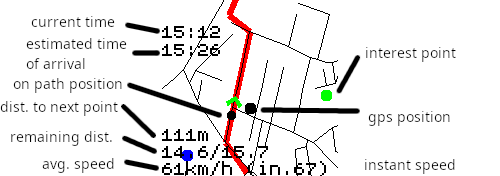

# Gipy

Gipy allows you to follow gpx traces on your watch.

It is mainly meant for bicycling but hiking might be fine.

It is untested on Banglejs1. If you can try it, you would be welcome.

This software is not perfect but surprisingly useful.

## Features

It provides the following features :

- display the path with current position from gps
- display a local map around you, downloaded from openstreetmap
- detects and buzzes if you leave the path
- (optional) buzzes before sharp turns
- (optional) buzzes before waypoints 
(for example when you need to turn in https://mapstogpx.com/)
- display instant / average speed
- display distance to next point
- display additional data from openstreetmap :
    - water points
    - toilets
    - artwork
    - bakeries

## Usage

### Preparing the file

You first need to have a trace file in *gpx* format.
Usually I download from [komoot](https://www.komoot.com/) or I export
from google maps using [mapstogpx](https://mapstogpx.com/). [Brouter](https://brouter.damsy.net) is
also a nice open source option.

Note that *mapstogpx* has a super nice feature in its advanced settings.
You can turn on 'next turn info' and be warned by the watch when you need to turn.

Once you have your gpx file you need to convert it to *gpc* which is my custom file format.
They are smaller than gpx and reduce the number of computations left to be done on the watch.

Just click the disk icon and select your gpx file.
This will request additional information from openstreetmap.
Your path will be displayed in svg.

### Starting Gipy

At start you will have a menu for selecting your trace (if more than one).
Choose the one you want and you will reach the splash screen where you'll wait for the map.
Once the map is loaded you will reach the main screen:

The screen is oriented so that the top of the image is in front of you.
It will rotate as you turn.
On your screen you can see:

- yourself (the big black dot)
- the path (thick red line)
- a green arrow telling you which way is forward
- if needed a projection of yourself on the path (small black dot)
- waypoints as large white dots
- some text on the left (from top to bottom):
    * current time
    * time to reach end point at current average speed
    * left distance till end of current segment
    * remaining distance / path length
    * average speed / instant speed
- interest points from openstreetmap as color dots :
    * red: bakery
    * deep blue: water point
    * cyan: toilets (often doubles as water point)
    * green: artwork
- a *turn* indicator on the top right when you reach a turning point
- a *gps* indicator (blinking) on the top right if you lose gps signal
- a *lost* indicator on the top right if you stray too far away from path

### Lost

If you stray away from path we will rescale the display to continue displaying nearby segments and
display the direction to follow as a purple segment.

Note that while lost, the app will slow down a lot since it will start scanning all possible points to figure out where you
are. On path it just needed to scan a few points ahead and behind.

The distance to next point displayed corresponds to the length of the black segment.

### Menu

If you click the button you'll reach a menu where you can currently zoom out to see more of the map
(with a slower refresh rate), reverse the path direction and disable power saving (keeping backlight on).

### Settings

Few settings for now (feel free to suggest me more) :

- lost distance : at which distance from path are you considered to be lost ?
- buzz on turns : should the watch buzz when reaching a waypoint ?
- disable bluetooth : turn bluetooth off completely to try to save some power. 
- brightness : how bright should screen be ? (by default 0.5, again saving power)
- power lcd off (disabled by default): turn lcd off when inactive to save power. the watch will wake up when reaching points
and when you touch the screen.

### Caveats

It is good to use but you should know :

- the gps might take a long time to start initially (see the assisted gps update app).
- gps signal is noisy : there is therefore a small delay for instant speed. sometimes you may jump somewhere else.
- if you adventure in gorges the gps signal will become garbage.
- your gpx trace has been decimated and approximated : the **REAL PATH** might be **A FEW METERS AWAY**
- sometimes the watch will tell you that you are lost but you are in fact on the path. It usually figures again
the real gps position after a few minutes. It usually happens when the signal is acquired very fast.
- buzzing does not always work: when there is a high load on the watch, the buzzes might just never happen :-(.
- buzzes are not strong enough to be always easily noticed.
- be careful when **GOING DOWNHILL AT VERY HIGH SPEED**. I already missed a few turning points and by the time I realized it,
I had to go back uphill by quite a distance.

## Creator

Feel free to give me feedback : is it useful for you ? what other features would you like ?

If you want to raise issues the main repository is [https://github.com/wagnerf42/BangleApps](here) and
the rust code doing the actual map computations is located [https://github.com/wagnerf42/gps](here).
You can try the cutting edge version at [https://wagnerf42.github.io/BangleApps/](https://wagnerf42.github.io/BangleApps/)

frederic.wagner@imag.fr
