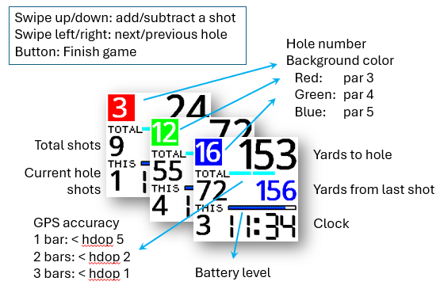
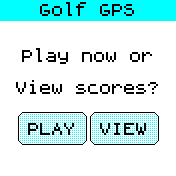
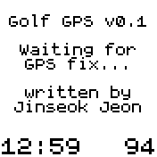
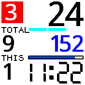
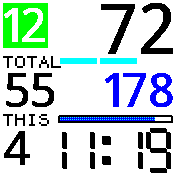
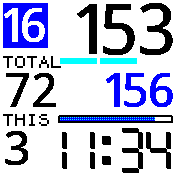
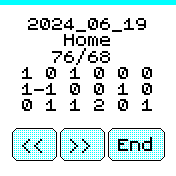

# Golf GPS
I have made a few watches for golfing. See this [LINK](https://jeonlab.wordpress.com/category/golf-gps-watch/) if you are interested.
Now that I have a Bangle.js 2 watch, I wanted to port my program to it for golfing. For my previous watches I have used TFT LCD or OLED displays and they all draw a lot of current and display information only when I press a button to wake up from the black screen. One of the best feature of the Bangle.js 2, I think, is the memory LCD which consumes very small power and it is always on! 

## Features
- Play or view previously played scores
- Save your favourite course data (see below instruction)
- In play mode
  - Hole number
  - Par as background color of the hole number (red: 3, green: 4, blue: 5)
  - Distance to the center of the green (coordinates you saved)
  - Distance from the last shot (where you swiped up to add a shot)
  - Number of shots on current hole
  - Total number of shots
  - Clock
    

- How to change holes and add/subtract shots
  - Swipe left/right to change the hole to next/previous (you can move to any hole to update your shots in case you entered wrong number of shots by mistake)
  - Swip up/down to add/subtract the number of shots. This will update the total number of shots as well as current shots.
- After the game
  - Press the button to either finish the game or go back to the play screen (if you pressed the button by accident).
  - If you choose to finish the game, it will show the summary of the score with 3x6 matix, shots - par. For example, -1 is for birdie and 0 is for par, and +2 is for double bogey. It also shows the total shots and total par as well.

## Course data
Before you run Golf GPS, you need to save your favourite golf course data into the storage area.
Download `storage-write.js` and open it from Espruino Web IDE (https://www.espruino.com/ide/) and enter your course data and run in RAM mode.
With this script, you can create, overwrite or append golf course GPS data. 
```
f = require("Storage").open("course-data","a"); // "w" to create or overwrite, "a" to append
```
There must be other ways to get the GPS coordinates for your course, but I use Google Maps. In satellite mode, click on the middle of each green will show you the coordinate, latitude and longitude. copy and paste it into the script for the holes 1 through 18 and add par per each hole. You will need 6 decimal places for the coordinate. Here is a format of the course data to put in the script.

```
"course name\n"+
"00.000000,00.000000,0\n"+
.
.
"00.000000,00.000000,0\n"+
"next course name\n"+
.
.
```
You can put any number of course data. Once the data file is created in the storage area, you can add more data to the same file using append ("a" ) mode with the same script. Just replace the data and change the mode to "a" and run in RAM mode.

One tip to wrap each line with `"----\n"+` is using the built-in edit feature of the Web IDE. In the Web IDE editor, enter GPS cordinates and par per hole, and then SHFT-ALT drag all lines including the course name, and hit HOME and type `"` and hit END and type `\n"+`.

## Screenshots










## Creator

Written by [JeonLab](https://jeonlab.wordpress.com)
