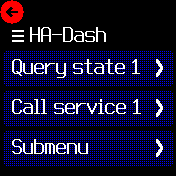

# Home-Assistant Dashboard

This app interacts with a Home-Assistant (HA) instance. You can query entity
states and call services. This allows you access to up-to-date information of
any home automation system integrated into HA, and you can also control your
automations from your wrist.

## How It Works

This app uses the REST API to directly interact with HA (which requires a
"long-lived access token" - refer to "Configuration").

You can define a menu structure to be displayed on your Bangle, with the states
to be queried and services to be called. Menu entries can be:

* entry to show the state of a HA entity
* entry to call a HA service
* sub-menus, including nested sub-menus

Calls to a service can also have optional input for data fields on the Bangle
itself.

## Configuration

After installing the app, use the "interface" page (floppy disk icon) in the
App Loader to configure it.

Make sure to set the "Home-Assistant API Base URL" (which must include the
"/api" path, as well - but no slash at the end).

Also create a "long-lived access token" in HA (under the Profile section, at
the bottom) and enter it as the "Long-lived access token".

The tricky bit will be to configure your menu structure. You need to have a
basic understanding of the JSON format. The configuration page uses a JSON
Editor which will check the syntax and highlight any errors for you. Follow the
instructions on the page regarding how to configure menus, menu entries and the
required attributes. It also contains examples.

Once you're happy with the menu structure (and you've entered the base URL and
access token), click the "Configure / Upload to Bangle" button.

## Security

The "long-lived access token" will be stored unencrypted on your Bangle. This
would - in theory - mean that if your Bangle gets stolen, the new "owner" would
have unrestricted access to your Home-Assistant instance (the thief would have
to be fairly tech-savvy, though). However, I suggest you create a separate
token exclusively for your Bangle - that way, it's very easy to simply delete
that token in case your watch is stolen or lost.

## To-Do

A better way to configure the menu structure would be useful, something like a
custom editor (replacing the jsoneditor).

## Author

Flaparoo [github](https://github.com/flaparoo)

