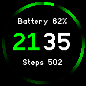
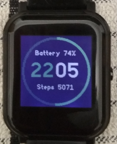
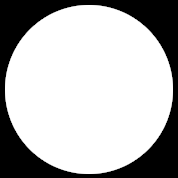
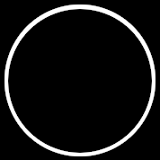
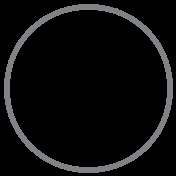
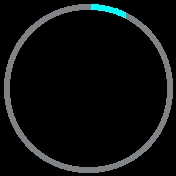

# The Ring

  *A proof of concept ring guage clock using images, acts as a tutorial piece for discussion*

Written by: [Hugh Barney](https://github.com/hughbarney) For support
and discussion please post in the [Bangle JS
Forum](http://forum.espruino.com/microcosms/1424/)

* The ring is a proof of concept to establish a clean way to draw a
large ring guage with few aliasing issues and artifacts.
* Rather than use grahics commands to draw the ring a series of fixed images are used.
* This allows for better accuracy of the initial image and also does not suffer from performance issues.
* The downside is that more storage and memory is used to hold the
  initial images.  This is not an issue on a Bangle 2.
* The ring effect is constructed from 14 images that represent a range of different percentages
* The percentages of the images are 0,2,4,7,10,20,30,40,50,60,70,80,90,100%
* The app is not intended to be enhanced further (apart from bug fixes) but rather as code that can be reused in other apps
* The full set of original images are included in the source code to demonstrate the concept
* I will use this code to build a new clock similar to Pastel but
  using this ring guage for steps.  The new clock will use more
  attractive fonts and provide a settings meu to change the primary
  color of the ring.

## Screenshots

It is worth looking at a photograph of the clock in action as the
screenshot does not do the final effect justice.

## Production

1.  I first generated a circle on black background using [The
Gimp](https://www.gimp.org/) image editor.  I used this [Youtube
video](https://www.youtube.com/watch?v=AoIAznSdLik) to get started.
The initial image is 178x178 pixels.

2. I then drew another smaller black circle over the top of the original to make a ring

3. From the empty ring image I coloured segments of the ring and saved new images at specific percentages

4. I used the file `calc_percentages.js` to work out the x and y
coordinates of the end point of each percentage position along the
ring.

5. The [Image
Converter](https://espruino.github.io/EspruinoWebTools/examples/imageconverter.html)
was used, set to 2-bit optimal, transparency Y, compression Y and
ImageObject Y, to convert each PNG file to code.

6. NOTE that the generated image object pallete seemed to switch the
order of the colors from 50% onwards.

7. The greying out of the unused part of the ring is acheived by
using a dithered color. So if the ring colour is green #0f0 then the
greyed out part is done in '#020'.

## Stages of The Ring

Below are some examples of the different stages of the ring

